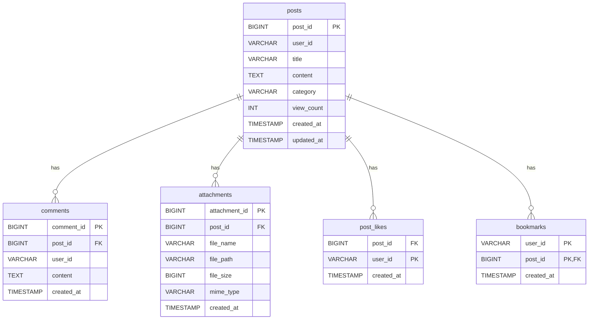

# 게시판 시스템 ERD (Entity Relationship Diagram)

## 관계 설명

1. **게시글(posts) - 댓글(comments)**: 1:N 관계
   - 하나의 게시글은 여러 개의 댓글을 가질 수 있음
   - 각 댓글은 하나의 게시글에만 속함

2. **게시글(posts) - 첨부파일(attachments)**: 1:N 관계
   - 하나의 게시글은 여러 개의 첨부파일을 가질 수 있음
   - 각 첨부파일은 하나의 게시글에만 속함

3. **게시글(posts) - 좋아요(post_likes)**: 1:N 관계
   - 하나의 게시글은 여러 개의 좋아요를 가질 수 있음
   - 각 좋아요는 하나의 게시글에만 속함

4. **게시글(posts) - 북마크(bookmarks)**: 1:N 관계
   - 하나의 게시글은 여러 개의 북마크를 가질 수 있음
   - 각 북마크는 하나의 게시글에만 속함
   - 북마크는 사용자 ID와 게시글 ID의 복합키로 식별됨

## 참고사항

- 모든 테이블은 UTF8MB4 문자셋과 utf8mb4_unicode_ci 콜레이션을 사용합니다.
- 외래 키는 CASCADE 삭제 규칙을 적용합니다.
- 사용자 ID는 외부 시스템에서 관리됩니다.
- 북마크 테이블은 사용자 ID와 게시글 ID의 복합키를 사용하여 중복 북마크를 방지합니다. 